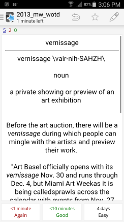

This is a small Scala app to scrape merriam-webster.com's word of the day archive for use with the spaced repetition app Anki. When used with the Android app, the card front/back look something like this:

It extracts the word, pronunciation, part of speech, definition, example usages, etymology, and related words.